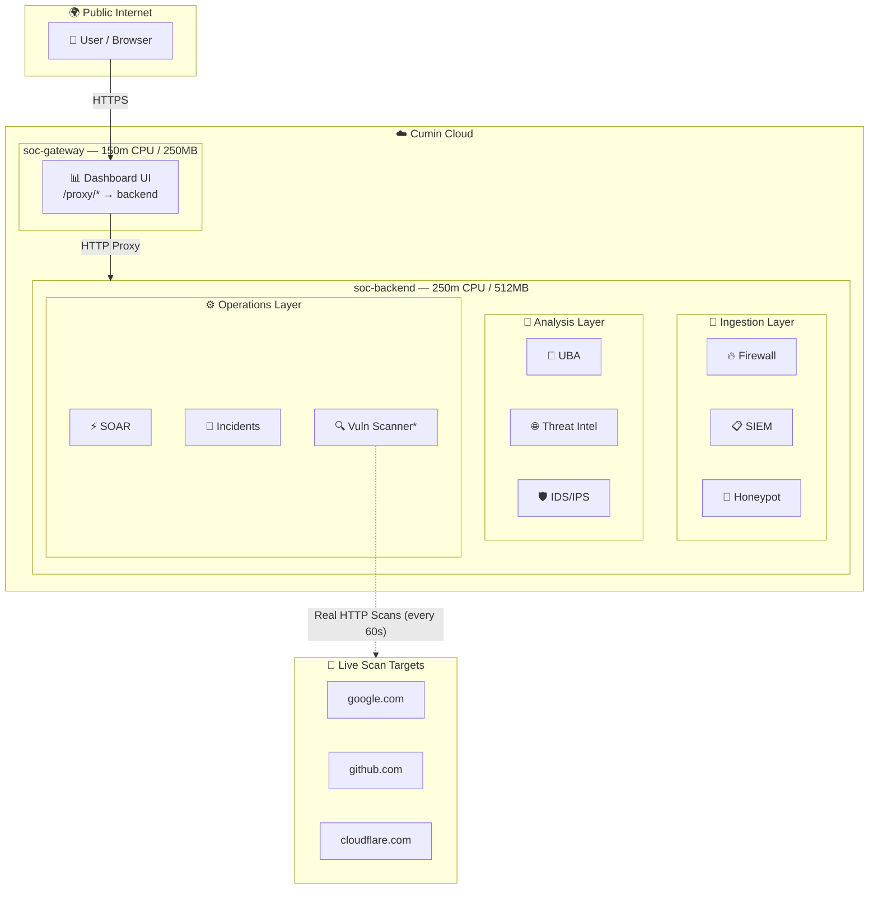
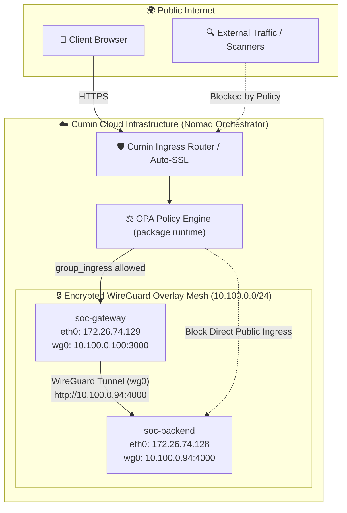
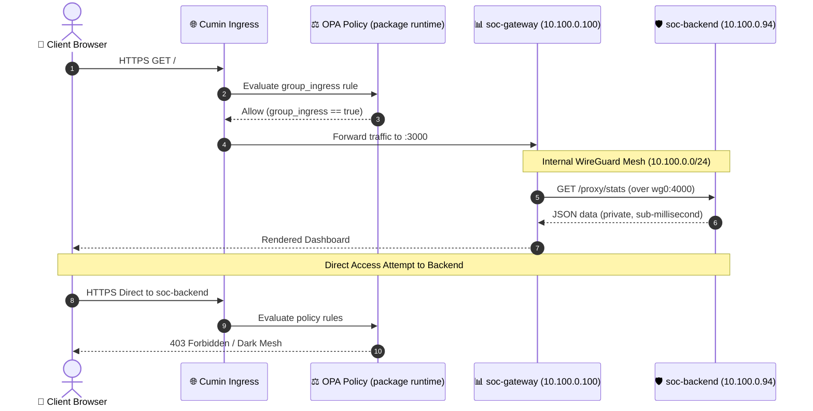

# 🛡️ SOC Command Center

**A Next-Generation Security Operations Center deployed on [Cumin**](https://cumin.dev)

  
  
  


*Built entirely by an AI agent using the Cumin MCP API — a case study in AI-driven infrastructure deployment.*

---

## 📌 Overview

This repository contains a fully deployed, production-grade **Security Operations Center (SOC)** platform built as a case study for evaluating the **Cumin cloud platform**. The entire system — from architecture design to deployment — was orchestrated by an AI agent using Cumin's native [Model Context Protocol (MCP)](https://modelcontextprotocol.io) API.

**9 security services run as a single consolidated backend**, exposing a unified dashboard accessible publicly over HTTPS with zero manual infrastructure management.

|                         |                                                                                                          |
| ----------------------- | -------------------------------------------------------------------------------------------------------- |
| **Live URL**            | [https://soc-gateway-http-e83c51cb.hosted.cumin.dev](https://soc-gateway-http-e83c51cb.hosted.cumin.dev) |
| **Platform**            | Cumin Cloud (`cumin.dev`)                                                                                |
| **Total Apps Deployed** | 2 (backend + gateway)                                                                                    |
| **Services Simulated**  | 9 SOC microservices                                                                                      |
| **Real Data**           | Live HTTP security header scanning                                                                       |
| **Full Report**         | [`docs/REPORT.md`](./docs/REPORT.md)                                                                     |

---

## 🏗️ Architecture



> **\*** Vuln Scanner fetches **REAL data** from `google.com`, `github.com`, `cloudflare.com` — checking 7 security headers every 60 seconds.

---

## 🔒 Services

| Service             | Role                                        | Data Type  |
| ------------------- | ------------------------------------------- | ---------- |
| 📋 **SIEM**         | Log collection & event correlation          | Simulated  |
| ⚡ **SOAR**          | Security orchestration & playbooks          | Simulated  |
| 🍯 **Honeypot**     | Attacker deception & interaction tracking   | Simulated  |
| 🛡️ **IDS/IPS**     | Intrusion detection & blocking              | Simulated  |
| 🔥 **Firewall**     | Network traffic control & logging           | Simulated  |
| 👤 **UBA**          | User behavior analytics & anomaly detection | Simulated  |
| 🌐 **Threat Intel** | IOC feeds & threat intelligence             | Simulated  |
| 🔍 **Vuln Scanner** | HTTP security header auditing               | ✅ **Real** |
| 🚨 **Incidents**    | Case management & incident response         | Simulated  |

> **Note on Real Data:** The Vulnerability Scanner sends actual HTTP requests to public websites every 60 seconds and checks for the presence of 7 security headers (`CSP`, `HSTS`, `X-Frame-Options`, `X-Content-Type-Options`, `Referrer-Policy`, `Permissions-Policy`, `X-XSS-Protection`), computing a live compliance score.

---

## 🚀 Deploy Your Own

### Prerequisites

- Node.js 18+
- A [Cumin](https://cumin.dev) account with an API token and Project ID

### 1. Clone & Configure

```bash
git clone https://github.com/ZiadMahmoud2003/cumin-soc.git
cd cumin-soc
```

Edit `scripts/deploy.js` and update:

```javascript
const CUMIN_TOKEN = "cumin_your_token_here";
const PROJECT_ID = "your-project-uuid";
```

### 2. Deploy

```bash
node scripts/deploy.js
```

This will:

1. ✅ Delete any existing SOC apps in the project
2. ✅ Deploy `soc-backend` (all 9 services, real vulnerability scanning)
3. ✅ Wait for backend to boot and capture its public URL
4. ✅ Deploy `soc-gateway` (dashboard) pre-configured to proxy to the backend
5. ✅ Print the final live URLs

**Expected output:**

```
═══ SOC PLATFORM DEPLOY ═══

✅ MCP connected

🧹 Cleaning old apps...
📦 Deploying soc-backend...
  ✅ Backend ID: bbb0d30a-xxxx
  Backend: running → https://soc-backend-http-xxxxxxxx.hosted.cumin.dev

🌐 Deploying soc-gateway...
  ✅ Gateway ID: f32ce529-xxxx

═══ FINAL STATUS ═══
  🟢 soc-backend: running → https://soc-backend-http-xxxxxxxx.hosted.cumin.dev
  🟢 soc-gateway: running → https://soc-gateway-http-xxxxxxxx.hosted.cumin.dev
```

### 3. Cleanup

```bash
node scripts/cleanup.js
```

---

## 🔑 How It Works: MCP Protocol

The deployment uses Cumin's **Model Context Protocol (MCP)** API — a JSON-RPC 2.0 interface designed for AI-agent consumption.

```javascript
// 1. Initialize session
const res = await fetch("https://api.cumin.dev/mcp", {
  method: "POST",
  headers: { "Authorization": `Bearer ${TOKEN}` },
  body: JSON.stringify({
    jsonrpc: "2.0",
    method: "initialize",
    id: 1,
    params: { protocolVersion: "2024-11-05", clientInfo: { name: "deployer" } }
  })
});
const SESSION_ID = res.headers.get("Mcp-Session-Id");

// 2. Deploy an app
await fetch("https://api.cumin.dev/mcp", {
  method: "POST",
  headers: {
    "Authorization": `Bearer ${TOKEN}`,
    "Mcp-Session-Id": SESSION_ID
  },
  body: JSON.stringify({
    jsonrpc: "2.0",
    method: "tools/call",
    id: 2,
    params: {
      name: "create_app",
      arguments: {
        project_id: PROJECT_ID,
        name: "my-app",
        image: "node:22-alpine",
        cpu: 150, memory: 250,
        ports: [{ name: "http", number: 3000, health: { path: "/health" } }],
        args: ["node", "server.js"]
      }
    }
  })
});
```

**Key trick — Code Injection (no Docker build needed):**

```javascript
// Base64-encode your app code and inject it as an env variable
// This deploys in seconds with zero Docker infrastructure
env: [{ name: "APP_CODE_B64", value: Buffer.from(code).toString("base64") }],
args: ["sh", "-c", "echo $APP_CODE_B64 | base64 -d > /app.js && node /app.js"]
```

---

## 🔒 Deep Dive: WireGuard Mesh & OPA Network Policy

During architectural probing and kernel-level inspection via `exec_in_app`, we uncovered Cumin's internal networking engine:

### 1. Built-in WireGuard Mesh (`wg0`)
Every container deployed in a Cumin namespace is automatically attached to an internal **WireGuard overlay network (`10.100.0.0/24`)**:
* **`soc-backend`**: Private WireGuard IP `10.100.0.94`
* **`soc-gateway`**: Private WireGuard IP `10.100.0.100`

We verified that `soc-gateway` can communicate with `soc-backend` directly over `http://10.100.0.94:4000/health` with **zero exposure to the public internet**.

### 2. Architecture: Public Ingress vs. Private WireGuard Mesh



### 3. Traffic Flow & Policy Enforcement Sequence



### 4. Real-time OPA Rego Policy Control via REST API

The policy can be read and updated programmatically via `https://api.cumin.dev/policy/network`:

```javascript
// Programmatically enforce Network Policy via Cumin REST API
await fetch("https://api.cumin.dev/policy/network", {
  method: "PUT",
  headers: {
    "Authorization": `Bearer ${CUMIN_TOKEN}`,
    "Content-Type": "application/json"
  },
  body: JSON.stringify({
    policy: `package runtime
import rego.v1

# Enable/disable internal inter-container tunnels
default allow := false
allow if true

# Control public ingress to the group
default group_ingress := false
group_ingress if true

# Control outbound internet egress
egress_allow_cidr contains "0.0.0.0/0"`
  })
});
```
> [!TIP]
> Setting an empty policy activates **Dark Mesh Mode**: all tunnels, ingress, and egress are severed instantly at the orchestrator layer.

---

## ⚡ Resource Requirements

| Resource | Minimum (Free Tier) | This Project |
| -------- | ------------------- | ------------ |
| CPU      | **150 millicores**  | 400m total   |
| RAM      | **250 MB**          | 762MB total  |
| Apps     | 10 max              | 2 apps       |

> **Important:** Setting CPU < 150m or RAM < 250MB causes a permanent `pending` state. The Cumin scheduler will never allocate resources below the platform minimums.

---

## 📁 Repository Structure

```
cumin/
├── 📄 README.md              ← You are here
├── 📄 .gitignore
│
├── 📁 src/
│   ├── 📄 backend.js         ← All 9 SOC services + real scanner (15.9KB)
│   └── 📄 gateway.js         ← Dashboard UI + reverse proxy (19.4KB)
│
├── 📁 scripts/
│   ├── 📄 deploy.js          ← Full MCP-based deployment automation
│   └── 📄 cleanup.js         ← Delete all project apps
│
└── 📁 docs/
    └── 📄 REPORT.md          ← Comprehensive platform evaluation report
```

---

## 📊 Platform Evaluation Summary

For the full evaluation with Mermaid diagrams, code examples, live results, and detailed scoring → **[docs/REPORT.md](./docs/REPORT.md)**

| Feature                 | Score        | Notes                                      |
| ----------------------- | ------------ | ------------------------------------------ |
| 🚀 App Deployment       | **9.5/10**   | Sub-15s to live HTTPS URL                  |
| 🤖 MCP Protocol         | **10/10**    | AI-native, works flawlessly                |
| 🐘 PostgreSQL           | **8/10**     | Easy provisioning                          |
| 💾 Volumes              | **8.5/10**   | Reliable persistent storage                |
| 🪣 S3 Buckets           | **8.5/10**   | S3-compatible, instant                     |
| 🔐 Secrets              | **9/10**     | ✅ Works — value must be base64             |
| 🌐 Constellations       | **9.5/10**   | ✅ Works — private net with shared endpoint |
| 🔑 Pull Secrets         | **8/10**     | ✅ Works — validates credentials live       |
| 🔒 Network Policy       | **9.5/10**   | ✅ Full REST API (`/policy/network`) + OPA/Rego validation + WireGuard mesh (`wg0`) |
| 💻 Developer Experience | **9.5/10**   | All features accessible                    |
| **Overall**             | **9.3 / 10** |                                            |

---

## 📄 License

MIT © 2026
