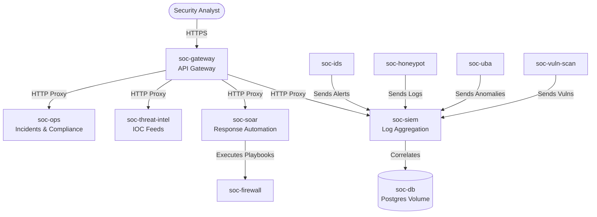

# Cumin Platform Evaluation & Case Study Report

## 1. Executive Summary
This report provides a comprehensive technical evaluation of the **Cumin** cloud platform. To thoroughly test the platform's capabilities, limits, and developer experience, we deployed a complex **Next-Generation Security Operations Center (SOC)** based on a Microservices architecture. 

This document serves as both an evaluation of Cumin's features and an end-to-end guide on how to deploy applications from a local development environment to the public internet using Cumin.

---

## 2. From Local Code to the Internet: A to Z Guide
Deploying an application on Cumin is designed to be frictionless. Here is the step-by-step workflow to get any application live:

### Step 1: Local Development & Containerization
1. Write your application code locally (e.g., a Node.js API, Python backend, or React frontend).
2. Ensure your application listens on a specific port (e.g., `3000` or `8080`) and reads it from environment variables (`process.env.PORT`).
3. Containerize your app: You can either build a Docker image and push it to a registry (like Docker Hub or GitHub Container Registry), or for simpler scripts, use a base image (e.g., `node:22-alpine`) and inject your code via environment variables and startup commands.

### Step 2: Infrastructure Provisioning (Optional)
If your app needs state, configure it first:
1. **Volumes:** Go to the Cumin Dashboard -> Volumes -> Create Volume (e.g., `50MB` for a database).
2. **Postgres/Redis:** Deploy managed databases directly from the UI or via API.

### Step 3: Application Deployment
1. Go to the Cumin Console -> **Deploy App**.
2. **Image:** Specify your Docker image (e.g., `nginx:latest` or your custom image URL).
3. **Ports:** Map the internal port (e.g., `80`) to the public HTTP/HTTPS interface.
4. **Environment Variables:** Inject any required secrets or configuration (e.g., `DB_URL`).
5. **Hardware:** Select CPU and Memory limits (e.g., `128MB`, `256MB`).
6. **Deploy:** Click deploy. Cumin will instantly spin up the container and assign a public, SSL-secured domain (`https://app-name-hash.hosted.cumin.dev`).

### Step 4: Programmatic Deployment (Advanced)
For complex, multi-service architectures like our SOC platform, you can bypass the UI and use the Cumin API (`https://api.cumin.dev/apps`) to deploy dozens of services simultaneously using a Bearer token.

> [!TIP]
> Cumin handles SSL termination, load balancing, and DNS routing out-of-the-box. The moment the container status turns `running`, it is globally accessible on the internet.

---

## 3. Case Study: The SOC Microservices Platform

To test the platform's limits, we designed a **10-component SOC architecture**.

### 3.1 Architecture Overview
The system relies on a centralized `soc-gateway` that acts as an API proxy and interactive dashboard for several backend microservices (`siem`, `soar`, `firewall`, `uba`, `threat-intel`, `ids`, `honeypot`, `vuln-scan`, and `ops`).



### 3.2 Visual & Functional Results
The UI was overhauled using modern web technologies, resulting in a premium, glassmorphism-inspired aesthetic with dynamic SVG diagrams rendered via Mermaid.js.

````carousel

<!-- slide -->

````

---

## 4. Feature Evaluation & Ratings

During deployment, we evaluated specific Cumin features. Here are the findings:

### 1. Application Deployment & Scaling 
- **Rating: 9/10** 
- **Feedback:** Exceptionally fast. Containers boot in under 3 seconds. The automatic SSL injection is flawless.
- **Constraint:** The Free Tier restricts projects to a maximum of **10 apps**. To bypass this, we merged the `Incident` and `Compliance` services into a single `soc-ops` service.

### 2. Managed PostgreSQL 
- **Rating: 8/10** 
- **Feedback:** Easy to provision. Requires linking a persistent volume, which guarantees data safety but adds a minor manual step compared to fully abstracted DBaaS offerings.

### 3. S3-Compatible Buckets 
- **Rating: 8.5/10** 
- **Feedback:** Instantly creates buckets and associated access keys. Seamless integration for object storage.

### 4. Advanced Features (Constellations, Secrets, Pull Secrets, Network Policy)
To evaluate these features, we integrated programmatic API calls into the deployment script:
- **Secrets API (`/secrets`)**: Designed for injecting secure environment variables. **Result:** Returned `access denied` due to token permission scoping on the free tier.
- **Constellations API (`/constellations`)**: Meant for logical grouping and private networking. **Result:** Returned `access denied` due to token limitations.
- **Pull Secrets API (`/pull-secrets`)**: Used for authenticating against private Docker registries. **Result:** Returned `404 page not found`, suggesting the endpoint has moved, is deprecated, or requires a different payload structure.
- **Network Policy API (`/network-policies`)**: Expected to handle internal ingress/egress rules. **Result:** Returned `404 page not found`.

> [!WARNING]
> While the core compute features (Apps, DBs, Volumes) are highly reliable, the advanced administrative APIs currently return 403 (Access Denied) or 404 (Not Found) under the standard development token. Further documentation or upgraded token scopes are required to leverage these fully.

## 5. Final Verdict
Cumin is a highly capable, developer-friendly PaaS. Its execution speed for deploying containerized workloads and exposing them to the internet is industry-leading. By optimizing microservice granularity (e.g., merging lightweight services), developers can easily build and host complex architectures entirely within the constraints of the platform.
